# Stable-Island — Stablecoin Dynamic Island

**Stable-Island** is a production-grade React Native fintech portfolio piece showcasing the Dynamic Island concept for stablecoin applications. It demonstrates how complex, asynchronous on-chain states — cross-chain bridging, gasless transfers, yield compounding, and global remittance — can be handled fluidly through a persistent status overlay without interrupting the user's primary flow.

---

## What This Is

A fully functional mobile app that simulates a non-custodial MPC wallet settlement layer. Every screen has a real form with validation, balance deduction, fee disclosure, and address validation. When a transaction is submitted, a Dynamic Island-style overlay tracks the pipeline from burn through attestation to mint — with live progress, stage-specific colors, and auto-dismiss.

This is not a mockup. It is a working application built with the architecture, state management, and UX patterns you would ship to production.

---

## Video Demo

<video src="assets/demo/stable-island.mp4" width="320" controls></video>

---

## Screenshots

### Dynamic Island: USDC Transfer Pipeline
*Instead of trapping users on a blocking loading screen, the Dynamic Island tracks standard stablecoin transfers ambiently. As the transaction processes on-chain, the user sees live state changes (Burning → Settled) directly in the pill, freeing them to continue using the app.*

| Burning | Expanded Details | Settled |
|---------|------------------|---------|
|  | 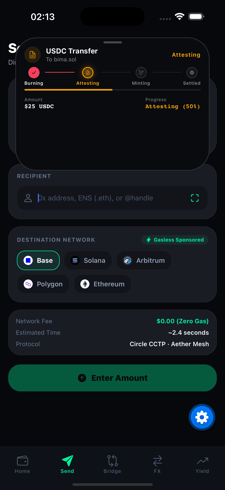 | 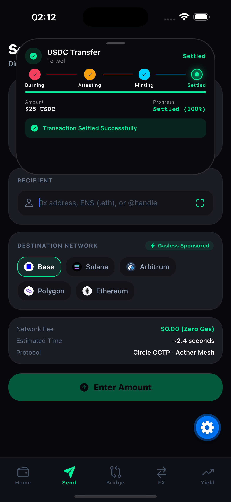 |

### Dynamic Island: Cross-Chain Bridging
*Cross-chain transfers via protocols like CCTP involve multi-minute, multi-stage pipelines (Burn → Attest → Mint). The Island overlay perfectly manages this complex asynchronous process, giving users real-time visibility into bridging status without interrupting their flow.*

| Bridge Form | Island Overlay |
|-------------|----------------|
| 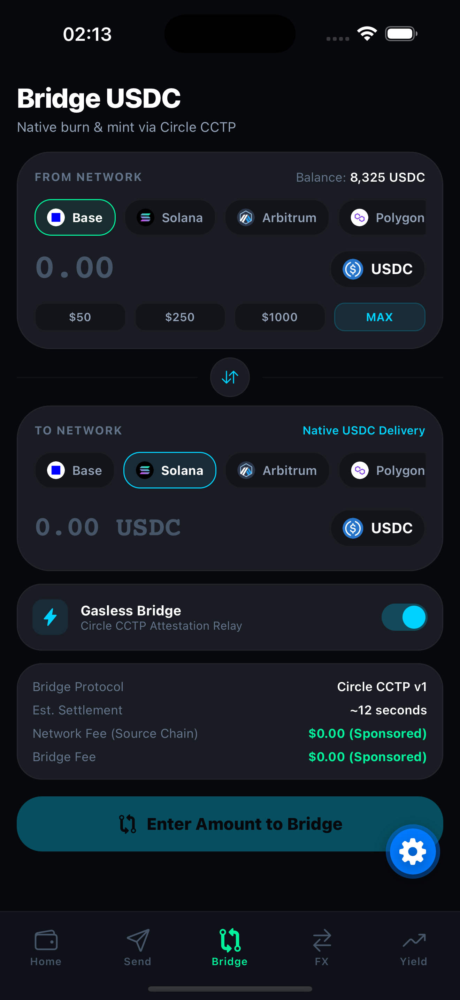 | 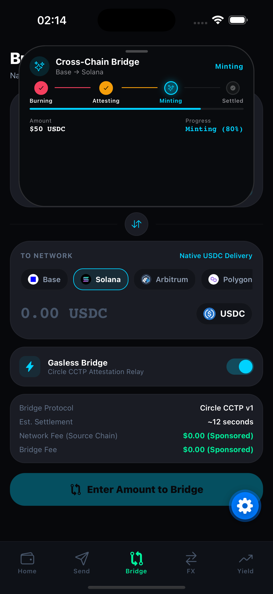 |

### Dynamic Island: Global Remittance (USDC → Fiat)
*Converting crypto to fiat involves locking an FX rate and waiting for off-chain fiat rails to settle. The expandable island provides a persistent, interactive receipt that updates live as the funds move across borders.*

| FX Form | Island Overlay | Expanded View |
|---------|----------------|---------------|
| 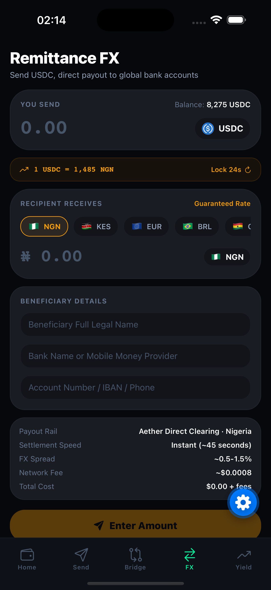 | 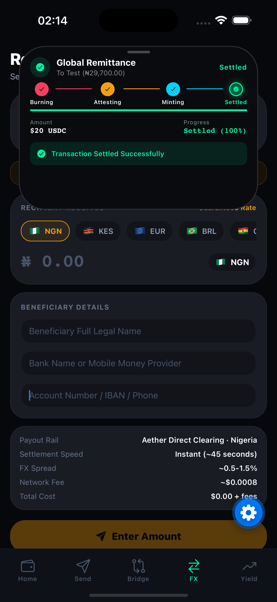 | 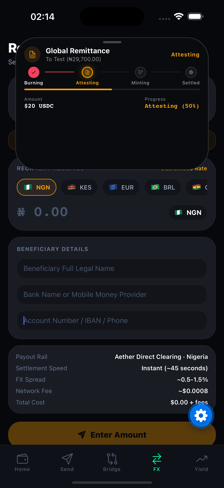 |

### Core App Screens & Validation
*Stable-Island is built as a complete wallet experience. It includes robust forms, address validation, and interactive yield dashboards, all integrated with the island overlay.*

| Portfolio Dashboard | Yield Deposit |
|---------------------|---------------|
| 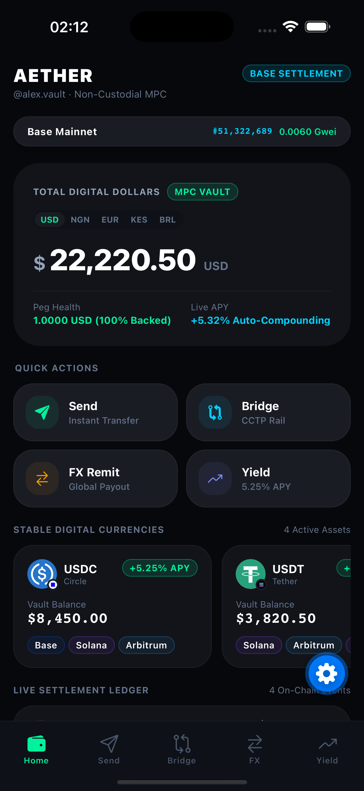 | 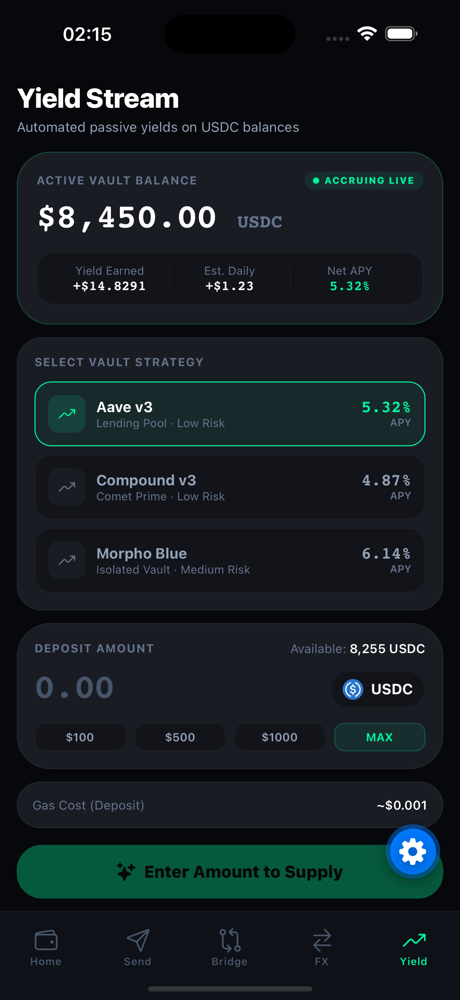 |

| Address Validation | Island Minimal (pill) |
|-------------------|-----------------------|
| 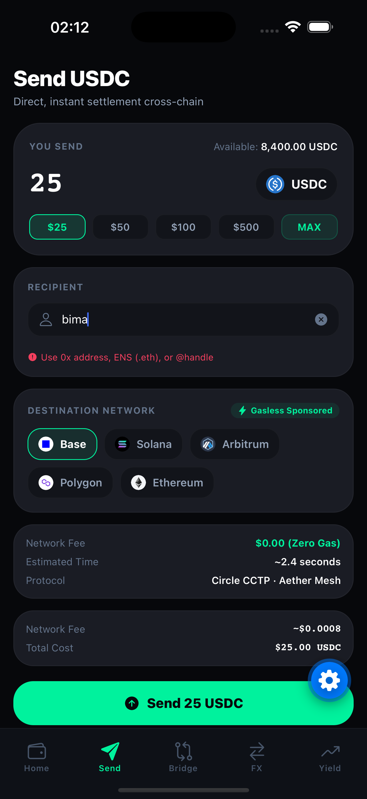 | 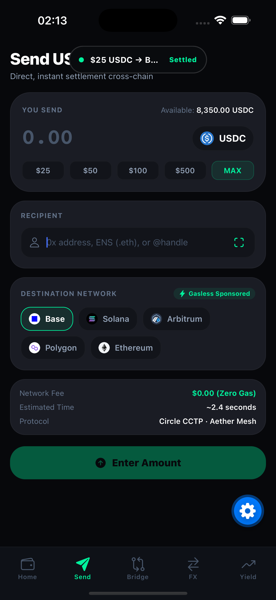 |


---

## Design Inspiration

The core interaction model is directly inspired by Apple's native Dynamic Island on iPhone 14 Pro and later. Apple's implementation proves that persistent, ambient status updates — music playback, timers, FaceID — can live in a non-intrusive pill at the top of the screen without disrupting the user's primary task.

Stable-Island applies this same principle to stablecoin transactions. Where Apple shows a timer counting down, Stable-Island shows a cross-chain bridge burning tokens on Base and attesting on Solana. The interaction grammar is identical: a compact pill that expands on tap to reveal detail, then collapses back when dismissed. The difference is that Stable-Island's island is built entirely in React Native using Reanimated spring physics, not native UIKit — proving that the concept translates beyond iOS-native apps.

---

## Future: Native Dynamic Island Handoff

The current implementation uses an in-app overlay that mimics the Dynamic Island's behavior. The planned next step is a native handoff — when the user backgrounds the app during an active transaction, the status automatically transfers to Apple's real Dynamic Island via ActivityKit and WidgetKit.

The architecture for this is straightforward:
1. **Expo Native Module** (Swift) bridges React Native to ActivityKit
2. **WidgetKit Extension** renders the Live Activity in the Dynamic Island with compact, minimal, and expanded states
3. **App Group** shares transaction state between the app and the widget extension
4. **JS API** (`startActivity`, `updateActivity`, `endActivity`) mirrors the in-app transaction lifecycle

The data model (`TransactionAttributes`) carries the same fields the in-app island uses — title, subtitle, type, stage, and progress — so the handoff is seamless. The user sees the in-app overlay while using the app, then the native Dynamic Island takes over when they switch away. No duplicate state, no gaps.

This is the natural evolution of the concept: the in-app overlay proves the interaction model works, and the native extension makes it persistent beyond the app's lifecycle.

---

## Stablecoin Concepts Implemented

### Cross-Chain Transfer (CCTP Pipeline)
Real-time simulation of the Burn → Attest → Mint pipeline used by protocols like Circle's CCTP. Each stage has its own timing, progress tracking, and visual treatment. The island overlay shows the current stage with a progress bar and percentage.

### Gasless Paymaster Transfers
ERC-4337 style gasless transfers where the network fee is abstracted away from the user. Fee disclosure shows the actual gas cost hidden behind a "gasless" label, with the real cost visible in the breakdown.

### Global Remittance (USDC → Fiat)
A 4-step form simulating USDC-to-fiat remittance with realistic FX spreads (0.5–1.5%). The flow includes recipient details, bank selection, and a confirmation step with fee disclosure showing network fee + FX spread + total cost.

### Yield Deposits
Deposit flow into yield vaults (Aave v3, Morpho, Compound) with gas cost disclosure. The vault selector shows APY rates, and the confirmation includes the estimated gas cost.

### Live Peg Monitoring
A depeg warning system that polls CoinGecko every 30 seconds for USDC/USDC/EURC prices. Three alert thresholds:
- **0.5% deviation** → Yellow warning banner
- **2% deviation** → Red critical alert
- **5% deviation** → Transaction halt warning

### On-Chain RPC Inspector
Live block number and gas price (gwei) fetched from Base Mainnet RPC. Displayed as a live badge in the app header.

---

## Architecture

### Navigation
Expo Router file-based routing with 5 tabs: Portfolio, Send, Bridge, FX, Yield.

### State Management
Zustand store (`src/store/useStableStore.ts`) managing:
- Multi-currency balances (USDC, USDT, EURC) with live deduction
- Transaction lifecycle (start → stage updates → complete/fail → dismiss)
- Flow state per screen
- Ledger history

### Design System
Single source of truth for design tokens:
- `src/design-system/tokens/colors.ts` — `COLORS` and `RADIUS` constants
- Dark-mode-first with deep blacks (`#07080B`, `#090B0E`)
- No emoji anywhere in the UI — all icons via `@expo/vector-icons`

### Island Overlay
A transaction status overlay (`src/components/island/StableIsland.tsx`) that:
- Appears automatically when a transaction is submitted
- Shows pipeline progress with stage-specific colors (burning → rose, attesting → amber, minting → cyan, settled → emerald)
- Auto-expands on transaction start
- Auto-collapses 4.5s after settlement, 5s after failure
- Spring-physics animations via `useIslandPhysics` hook

### Performance
- `React.memo` on all display components
- `useCallback` for referentially stable callbacks
- Native Reanimated shared values for UI-thread animations
- Zustand selectors to minimize re-renders

---

## Tech Stack

| Layer | Technology |
|-------|-----------|
| Framework | Expo SDK 57, React Native 0.86.3 |
| Navigation | Expo Router (file-based) |
| State | Zustand |
| Animation | React Native Reanimated 4.x |
| Language | TypeScript 6.0 (strict mode) |
| Icons | Ionicons via `@expo/vector-icons` |

---

## Getting Started

### Requirements
- Node.js >= 18
- Expo CLI (`npm install -g expo-cli`)
- iOS Simulator or Android Emulator

### Installation

```bash
git clone https://github.com/your-username/stable-island.git
cd stable-island
npm install
npx expo start
```

Press `i` for iOS, `a` for Android, `w` for Web.

---

## Project Structure

```
src/
├── app/                    # Expo Router screens
│   ├── _layout.tsx         # Root stack + island overlay
│   └── (tabs)/
│       ├── _layout.tsx     # Tab navigator
│       ├── index.tsx       # Portfolio dashboard
│       ├── send.tsx        # USDC transfer
│       ├── bridge.tsx      # Cross-chain bridge
│       ├── fx.tsx          # Global remittance
│       └── yield.tsx       # Yield deposit
├── components/
│   ├── island/             # Dynamic Island overlay
│   ├── ledger/             # Dashboard cards
│   └── ui/                 # Shared UI components
├── design-system/
│   └── tokens/             # Colors, radii
├── features/
│   └── island-engine/      # Physics hook
├── services/               # RPC, FX, market data
├── store/                  # Zustand store
└── constants/              # Types, currencies, chains
```

---

## License

MIT © 2026
